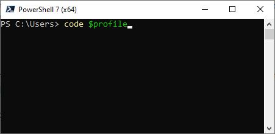

# PowerShell-Course

This readme contains the content for the entire course.

whats missing?
- [ ] function stuff (near bottom)
- [ ] API stuff (near bottom)
- [ ] loop stuff(near bottom)
- [ ] short explanation of wildcards

## Prerequisits

The following tools must be installed before the course starts.

- Visual Studio Code - https://code.visualstudio.com/
- GitHub Desktop - https://desktop.github.com/ (unless you allready know git.)
- Powershell 7 - https://github.com/PowerShell/PowerShell#get-powershell

The following should be done before the course starts.

- Create a Github account https://github.com/
- setup my predictive intellisense powershell config

### My Predictive intellisense powerhell config

Predictive intellisense does this


uses your previously typed in commands to predict what you want to type in next. Big help in learning.

here is the config

```powershell
# these are my predictive intellisense settings. 
# grabbed the essentials from the link below.
# https://devblogs.microsoft.com/powershell/announcing-psreadline-2-1-with-predictive-intellisense/
Set-PSReadLineOption -PredictionSource History
Set-PSReadLineOption -HistorySearchCursorMovesToEnd
Set-PSReadLineKeyHandler -Key UpArrow -Function HistorySearchBackward
Set-PSReadLineKeyHandler -Key DownArrow -Function HistorySearchForward
Set-PSReadLineKeyHandler -Chord "Ctrl+f" -Function ForwardWord
Set-PSReadLineKeyHandler -Chord Shift+Tab -Function MenuComplete
Set-PSReadLineKeyHandler -Chord Ctrl+b -Function BackwardWord
```

after installing VSCode, Powershell 7+ and Githubdesktop. 

open powershell 7(not windows powershell),
type `code $profile`. hit enter. 

 wait for visual studio code to launch and paste in my predictive intellisense config. save this file and it should be good to go.

the powershell profile loads every time you open powershell so this is a nice place to store things you often need in powershell.

#### `code $profile` not launching visual studio code?

this can happen if your system image is lacking shell components. the following solution pasted into a powershell window run as admin should solve it

```powershell
Get-WindowsCapability -Name "*ShellComponents*" -Online | Add-WindowsCapability -Online
```

## Tools

### Visual Studio Code

Visual Studio Code vs Notepad++. VSC is just better.

- Official editor for powershell. Powershell ISE deprecated
- Github integration

<https://code.visualstudio.com/>

try the keybindings. spesifically Ctrl+shift+P and alt+click
<https://code.visualstudio.com/docs/getstarted/keybindings>
<https://code.visualstudio.com/shortcuts/keyboard-shortcuts-windows.pdf>

### Github

- version control.
- sharing and collaboration.

<https://github.com/>

### Powershell 7

<https://github.com/PowerShell/PowerShell>

- crossplatform
- predictive intellisense
- multithreading

```powershell
# slow 1 by 1
1..10 | foreach-object { test-connection 195.88.55.$_ -count 1 -quiet}
# all 10 at the same time!
1..10 | foreach-object -ThrottleLimit 10 -Parallel { test-connection 195.88.55.$_ -count 1 -quiet}
```

- just better than powershell 5

## Common commands

|CMD|Powershell|Powershell Alias|
|-|-|-|
|ping|Test-NetConnection / Test-Connection |tnc|
|cd|Set-Location|sl, cd, chdir|
|dir|Get-ChildItem|gci,dir,ls|
|ipconfig|Get-NetIPConfiguration|gip|
|tracert|Test-NetConnection -traceroute|tnc -tr|
|shutdown|Stop-Computer / Restart-Computer||
|type|get-content|cat, gc, type|

All powershell functions are built using verb-noun

Verb = get, set, stop, remove, test, invoke...

Noun = cat, london, chair, cleanliness, assignment, computer...

if you are creating your own functions. look at the list approved verbs <https://docs.microsoft.com/en-us/powershell/scripting/developer/cmdlet/approved-verbs-for-windows-powershell-commands?view=powershell-7.2>

with the verb-noun information we can quickly get more commands

```powershell
Get-Command -Verb "get" -Noun "loc*"
Get-Command -Noun "location"
```

### Task 1

explore the commands in table above. ping some website

test out predictive intellisense with shift+tab. Try it with

- `Get-NetIPConfiguration -`
- `Test-Connection -`
- try out `Test-Connection -Quiet -TargetPath "<Your Favorite site>"`

## Variables and data types

variable is a way to store something for easy reuse later on.

you have built inn variables like $ErrorActionPreference

```powershell
# this should display all variables
Get-Variable
```

and user defined ones that you make yourself.

```powershell
$myGivenName = "David"
$mySurname = "Etternavn"
$myGivenName + " " + $MySurname
$var1 = "-1"
$var2 = 2
$sum = $var1 + $var2
$sum

$var2.GetType()


[int32]$var1 + $var2

# you also have more datatypes like these or more
$var1 = $true
$var2 = 10L
$var2 = [int64]"10"
```

Enviromental variables are also quite usefull
`$env:` and shift tab will displaythem.
$env:username and $env:userprofile when writing scripts makes them easier to use for multiple users.

### Task 2

explore the different enviromental variables.
use them with for example set-location and get-childitem

## Basic text manipulation

### single quotes and double quotes

single quotes is pure text. double quotes can expand variables inside it

```powershell
$language = 'Powershell'
$color = 'purple'
$sentence = "$language the powershell mascot has $color hair"
$sentence2 = '$language the powershell mascot has $color hair'

# you dont have to store it as a variable to run it. this also works fine
"$language the powershell mascot has $color hair"
```

### here string

represented with `@"  "@` block with either singlequote or double quote. Since anything inside it is displayed. the ending block has to be without tab or spaces and on a new line to work. otherwise it wont terminate the here string

```powershell
$date = Get-Date
$herestring = @"
This is a string
        Today's date is : $date
fancy ascii art or whatever
                     `. ___
                    __,' __`.                _..----....____
        __...--.'``;.   ,.   ;``--..__     .'    ,-._    _.-'
  _..-''-------'   `'   `'   `'     O ``-''._   (,;') _,'
,'________________                          \`-._`-','
 `._              ```````````------...___   '-.._'-:
    ```--.._      ,.                     ````--...__\-.
            `.--. `-`                       ____    |  |`
              `. `.                       ,'`````.  ;  ;`
                `._`.        __________   `.      \'__/`
                   `-:._____/______/___/____`.     \  `
                               |       `._    `.    \
                               `._________`-.   `.   `.___
                                             SSt  `------'`
"@
```

### Command execution

with command execution $() you can run big chunks of code inside your text if you wanted to or just singular commands.

```powershell
$date = Get-Date
$string = "today is $date"

# the above could also be written as
$string = "today is $(Get-Date)"
```

### TASK 3

store some ascii art as a here-string
try shoving in a variable with your name someplace and also running any powershell command you like using command execution.

more on this topic here

<https://docs.microsoft.com/en-us/powershell/scripting/learn/deep-dives/everything-about-string-substitutions?view=powershell-7.2>

## Objects and properties

```powershell
$var = "stuff written here", "more stuff written here"

# check these out
$var | Get-Member
Get-Member -InputObject $var
```

### task 4

- run the `var =` command above, try a $var.count, $var.length
- test-netconnection and test-connection your favorite website, and save them as a variable.
- try get-member and access the different properties using $var.InsertPropertyName
- try `$variable | select-object address` on both test-connection and test-netconnection variables.

## Arrays,Arraylists and hashtables

### array

creation of an empty array

```powershell
$data = @()

# check the count to see if its empty or not.
$data.Count
```

creation of an array with values in one go

```powershell
$data = @('Zero', 'One', 'Two', 'Three')

# checking its contents.
$data.count
$data

# or multiline since its easier to read
$data = @(
    'Zero'
    'One'
    'Two'
    'Three'
)
```

comma separated lines can also create an array and work mots of the time.

```powershell
$data = 'Zero', 'One', 'Two', 'Three'
```

to access individual items use brackets []. remember that the first item is [0]

```powershell
#  
$data[0]
$data[3]

# negative values go from the end. so last item is [-1]
$data[-1]

# multiple also possible
$data[3, 0, 3]

#or range with the .. operator
$data[1..3]

# or reverse
$data[3..1]
```

updating values and adding to an array

```powershell
# updating a value
$data[1] = "fifty"

# adding to an array
$data += "four"

```

more info on arrays <https://docs.microsoft.com/en-us/powershell/scripting/learn/deep-dives/everything-about-arrays?view=powershell-7.2>

### Arraylist

arrays are slow to manipulate when large. adding to an array doesnt append the data, it breaks down the array and stores it again.

Arraylists handles adding items quickly. I personally almost always use arraylists.

```powershell
# creating an array and adding to it.
$myarray = [System.Collections.ArrayList]::new()
[void]$myArray.Add('Value')
$somevalue ="othervalue"
[void]$myArray.Add($somevalue)

# and removing from array
$everyExistingFolder.Remove('Value')

```

`[void]` is used to supress the return code when adding values. try it without.

### Pscustomobject

```powershell
$myObject = [PSCustomObject]@{
    Name     = 'Kevin'
    Language = 'PowerShell'
    State    = 'Texas'
}

# can be accessed like a normal object
$myObject.Name

# adding new properties to an object
$myObject | Add-Member -MemberType NoteProperty -Name 'ID' -Value 'KevinMarquette'

# and looking at it
$myObject.ID

# removing a property 
$myObject.PSObject.Properties.Remove("ID")

# when using objects in strings. funny thing can happen
"hello $myobject" 
# this above would print as hello @{ Name=Kevin; Language=PowerShell; State=Texas }
# $() is how you expand on something on an expression in a string 
"hello $($myobject.name)"
```

more info on pscustomobjects <https://docs.microsoft.com/en-us/powershell/scripting/learn/deep-dives/everything-about-pscustomobject?view=powershell-7.2>


### Hashtable

Super fast but has its limits. If you encounter preformance issues. look into converting your arrays or arraylists if possible to hashtables.

```powershell
$htable = @{ EmpName="Charlie"; City="New York"; EmpID="001" }
$htable2 = @{
    “Key1” = “value1”
    “Key2” = “value2”
    Key3 = "value3"
}
```

### Task 5

- Create an array and an arraylist.
- Add a psCustomObject to each, add one text string and one number(make sure its stored as an int)
- Access individual items in the array and array list.
- Run .gettype() on the array/arraylist and the individual items.

## piping

Pipe `|` is usefull for oneliners but generaly slower than other methods, using it in the command line is fine. using it in scripts if you hit performance issues might be something to consider removing.

```powershell
'wuauserv' | Get-Service 
'wuauserv' | Get-Service | Stop-Service
'wuauserv' | Get-Service 
'wuauserv' | Get-Service | start-service
# you can also get the content of a text file and pipe it along

```

### task 6

- find 3 services, store them in a text file and try piping it to get-service.

```powershell
Get-Content -Path $env:USERPROFILE\Services.txt | Get-Service
```

## operators

More about operators here
<https://docs.microsoft.com/en-us/powershell/module/microsoft.powershell.core/about/about_operators?view=powershell-7.2>
or `get-help about_operators`

There are plenty but the logical and comparison operators are the most used ones.

### Comparison operators

- `1 -eq 1`
- `1 -ne 1`
- `(0..10) -contains 8`
- `"burgers are awesome" -like "\*are\*"`
- `"burger" -match "burger"`
- `1 -gt 2`
- `1 -lt 2`
- `3 -ge 3`

etc.

### logical operators

- `1 -eq 1 -and 1 -eq 2`
- `1 -eq 1 -or 1 -eq 2`
- `1 -eq 1 -xor 1 -eq 2`
- `-not(1 -eq 1)`

`-xor` is exclusive or.


### task 7

Try running the operators listed

## controll flow

### if

```powershell
if (1 -eq 1) { "hurray, its true" }
# or more complex
if (Test-Connection -count 1 -quiet nrk.no) { "NRK is online" }
```

### if not

```powershell
if (-not ( 1 -eq 2)) { $true }
# or 
if (!( 1 -eq 2)) { $true }
```

### else and else if

```powershell
if (Test-Connection -Count 1 -Quiet nrk.no) { "NRK is online" }
else { "NRK is not responding" }
```

```powershell
if (Test-Connection -Count 1 -Quiet nrk.no) { "NRK is online" }
elseif (Test-Connection bbc.com -Count 1 -Quiet) { "bbc is online" }
elseif (1 -eq 3) { "can have many more" }
else { "NRK is not responding" }
```

### switch

switch is like an if statement. but much simpler when it comes to checking multiple conditions.

```powershell
switch (3)
{
    1 { "It is one." }
    2 { "It is two." }
    3 { "It is three." }
    4 { "It is four." }
}

# or multiple, or text.
switch (4, 2, "five")
{
    1 { "It is one." }
    2 { "It is two." }
    3 { "It is three." }
    4 { "It is four." }
    3 { "Three again." }
    "five" { "It is five." }
}
```

more about switches <https://docs.microsoft.com/en-us/powershell/module/microsoft.powershell.core/about/about_switch?view=powershell-7.2>

### Task 8

- Write something using controll flow that tells you if the current time is after lunch(11:00 local time)
- Write something using controll flow that tells you if you have:
  - good ping (less than 30)
  - bad ping (more than 100)
  - ok ping (somewhere inbetween good and bad)

Remember that switch is a thing.

### loops

#### For loop

Good for doing something X amount of times, every other time,
basic scripting you probably wont need for loop that much, but if you draw graphics with code its more usable.

```powershell
# <Init> intialises the counter
# <Condition> for continuing and doing your thing is this.
# <Repeat> adding to your conter, usually $i++ (adds 1) or even $i+=2 (adds two)
for (<Init>; <Condition>; <Repeat>)
{
    <Statement list>
}

# A simple for loop would look like this

for ($i = 0; $i -lt 100; $i++) {
    Write-Host "im doing something 100 times, this is #$i"
}

# or you can count the number of things in an array

$list = "Finn", "Jake", "Princess bubblegum", "Steve"
for ($i = 0; $i -lt $list.Count; $i++) {
    Write-Host "$($list[$i]) is a cool person"
}
```

#### Foreach

Probably the easiest to use.

```powershell
$list = "Finn", "Jake", "Princess bubblegum", "Steve"
foreach ($person in $list) {
    write-host "$person is a cool person"
}
```

#### foreach-object

this uses the pipeline which is seen as slower.

```powershell
$list = "Finn", "Jake", "Princess bubblegum", "Steve"
$list | ForEach-Object {"$_ is a cool person"}
```

There is one way this can be faster than all other loops in some circumstances. any one remember?

#### Foreach method

the fastest loop and my favorite.

```powershell
$list = "Finn", "Jake", "Princess bubblegum", "Steve"
$list.ForEach({ "$_ is a cool person" })
```

there might be some faster but then your probably a c# nerd using .net stuff.

#### While

```powershell
while($val -ne 3)
{
    $val++
    Write-Host $val
}
```

#### do while and do until

```powershell
# do while
do { <statement list> } while (<condition>)
# do until
do { <statement list> } until (<condition>)


$x = 1,2,78,0
do { $count++; $a++; } while ($x[$a] -ne 0)

$x = 1,2,78,0
do { $count++; $a++; } until ($x[$a] -eq 0)

as you can see -ne (not equal) and -eq (equal) is changed.

```

where, binarysearch,hashtable, sorting

## Functions
Take a look at all the approved verbs here:
https://learn.microsoft.com/en-us/powershell/scripting/developer/cmdlet/approved-verbs-for-windows-powershell-commands?view=powershell-7.2

You're able to use automatic variables in functions like:
- [$PSBoundParameters](https://learn.microsoft.com/en-us/powershell/module/microsoft.powershell.core/about/about_automatic_variables?view=powershell-7.3#psboundparameters)
- [$PSCmdlet](https://learn.microsoft.com/en-us/powershell/module/microsoft.powershell.core/about/about_automatic_variables?view=powershell-7.3#pscmdlet)

You can have 2 different types, basic- and advanced-functions.

Basic functions would just have the bare minimum in order to create a function.
```powershell
function Verb-Noun {
    param (
        [string]$Param1,
        [int]$Param2
    )

    #CODE
}
```

Advanced functions are a little more complex, but have much more functionality. Therefore we most likely would always want to create an advanced function. Here's a basic version of an advanced function.
```powershell
function Verb-Noun {
    [CmdletBinding()]
    param (
        [string] $Param1,
        [int] $Param2
    )
    
    begin {
        #CODE
    }
    
    process {
        #CODE
    }
    
    end {
        #CODE
    }
}
```
The advantage of using an advanced function is that it has a lot of built-in functionality. You can e.g. create a function that has parameters that are exclusive from one another.
You can see more of this in the [Get-MrfkUserInfo](https://github.com/NorskNoobing/NN.MrfkCommands/blob/main/source/Public/Get-MrfkUserInfo.ps1) function.

```powershell
function Verb-Noun {
    [CmdletBinding(DefaultParameterSetName="username")]
    param (
        [Parameter(ParameterSetName="username")][string]$Username,
        [Parameter(ParameterSetName="displayname")][string]$DisplayName,
        [Parameter(ParameterSetName="mobilephone")][string]$MobilePhone
    )

    process {
        switch ($PsCmdlet.ParameterSetName) {
            "username" {
                $filter = "SamAccountName -like `"$Username`""
            }

            "displayname" {
                $filter = "DisplayName -like `"$DisplayName`""
            }

            "mobilephone" {
                $filter = "MobilePhone -like `"$MobilePhone`""
            }
        }

        Get-ADUser -Filter $filter
    }
}
```

You could merge a collection of functions into a module, which you can use to easily import functions across multiple users or devices, and update to new versions of the functions. This would atleast be better than having a bunch of custom functions in your `$PROFILE`. You can take [NN.MrfkCommands](https://github.com/NorskNoobing/NN.MrfkCommands) as an example (if one is needed).

## Creating a function

Should hand out a cheat sheet for this stuff abve. quick look up on the things mentioned above so they can easily look at when doing some ez labwork.

What i usualy do to quickly generate arrays or get stuff from clipboards is this.

```powershell
# i use this 
$stuff = Get-Clipboard | Where-Object { $_ }

# or this, which is same as above but with short names / aliases
$stuff = gcb |? { $_ }
```

`Get-Clipboard` gets from your clipboard, whatever you have CTRL+Ced
the above can be saved in a function you put in your profile.

TASK

## Modules

Some stuff from these modules as they will daily look at AD and SCCM stuff.
AD module (get-aduser, get-adgroup etc).

You can run this function in order to get a list of all the functions in the module.
```powershell
Get-Command -Module "MODULENAME"
```

### ImportExcel module
https://github.com/dfinke/ImportExcel
```powershell
Import-Excel -Path "PATH"
```

```powershell
Export-Excel -Path "PATH"
```

### ActiveDirectory module
The AD-module is installed by default on `wintools04`.

You can run the following functions to get either users or groups from AD.
```powershell
Get-ADUser "USERNAME"
```

```powershell
Get-ADGroup "GROUPNAME"
```

```powershell
Get-ADComputer "COMPUTERNAME"
```

### ConfigurationManager module
MECM module to find deployed computers, who has logged on, their ip etc.

You can import the module by running the following on `wintools04`.
```powershell
Import-Module ConfigurationManager
Set-Location ps1:
```
You'll have to set the psdrive to ps1 in order to make all the functions work.

If you want to get the computerinfo of a specific computer you can run the following.
```powershell
Get-CMDevice -Name "LT-SADM-001"
```

## API

### what is an api?

APIs can handle Create, Read, Update and Delete operations.

A webhook is a lightweight API that powers one-way data sharing triggered by events, such as you pushing a button.

Almost all APIS use JSON to structure data.

```json
{
    "glossary": {
        "title": "example glossary",
        "GlossDiv": {
            "title": "S",
            "GlossList": {
                "GlossEntry": {
                    "ID": "SGML",
                    "SortAs": "SGML",
                    "GlossTerm": "Standard Generalized Markup Language",
                    "Acronym": "SGML",
                    "Abbrev": "ISO 8879:1986",
                    "GlossDef": {
                        "para": "A meta-markup language, used to create markup languages such as DocBook",
                        "GlossSeeAlso": ["GML", "XML"]
                    },
                    "GlossSee": "markup"
                }
            }
        }
    }
}
```

```powershell
#flat easy json file to grasp
$ip = "1.1.1.1"
Invoke-RestMethod -uri "https://ipinfo.io/$ip/json"
# this weather one has alot more depth with forecast every hour etc. so getting the weather right now requires some more 
$lat = "34.05"
$lon = "-118.24"
$weather = Invoke-RestMethod -uri "https://api.met.no/weatherapi/locationforecast/2.0/compact?&lat=$lat&lon=$lon"
$weather.properties.timeseries[0].data.instant.details
```
## Self Learning

- PSkoan
  - Interactive learning. try doing 1 PSKoan at work everyday. <https://github.com/vexx32/PSKoans>
- do stuff with powershell instead of GUI

### task future

Install [PSkoans](https://github.com/vexx32/PSKoans#prerequisites) by following the link. Go through installation of prereqs and the module. Solve the first Koan.
